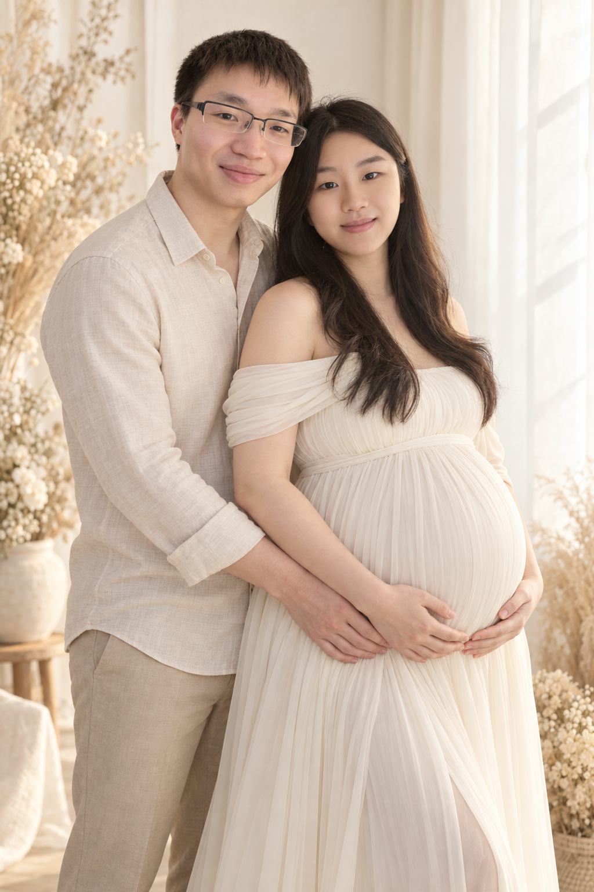
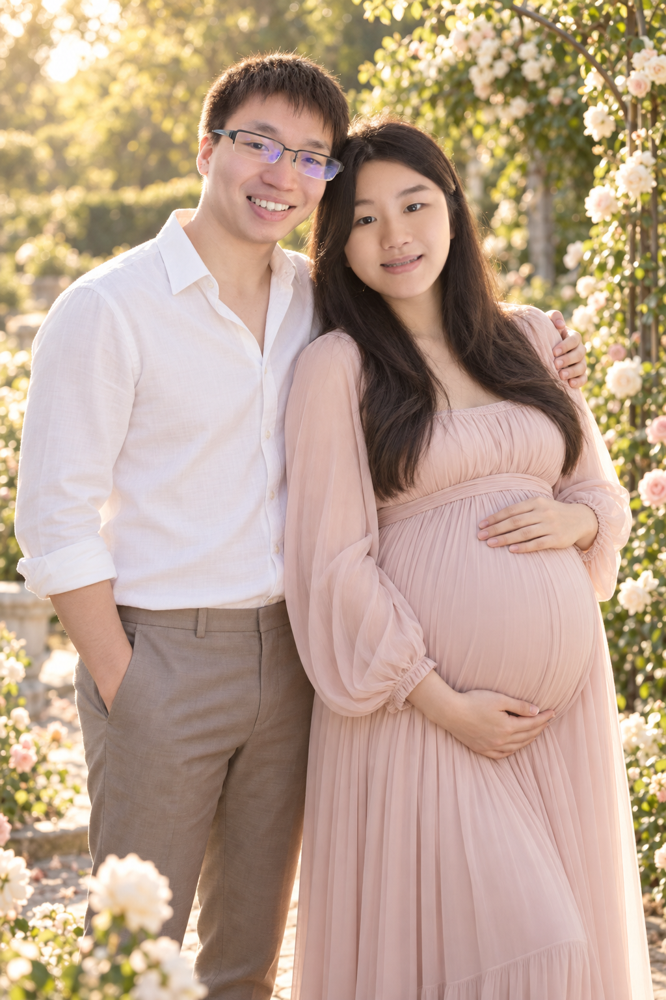
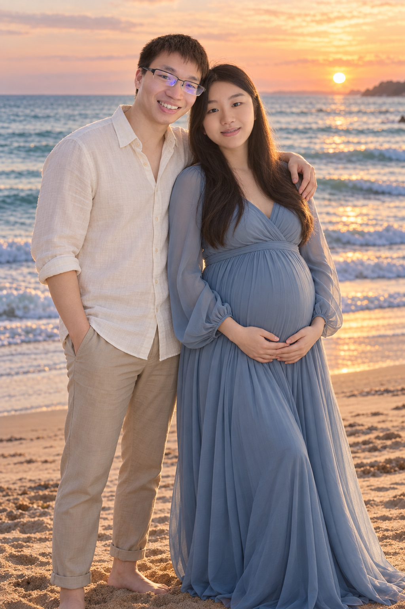
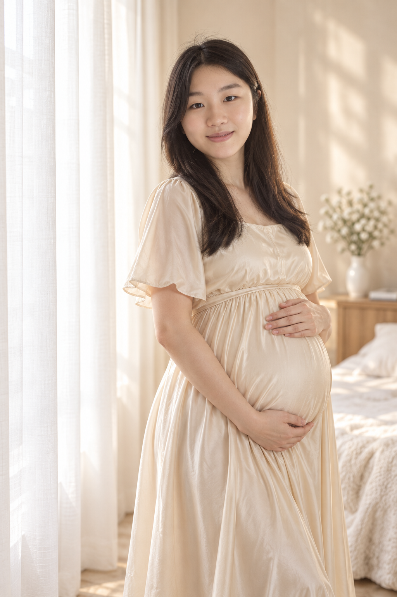
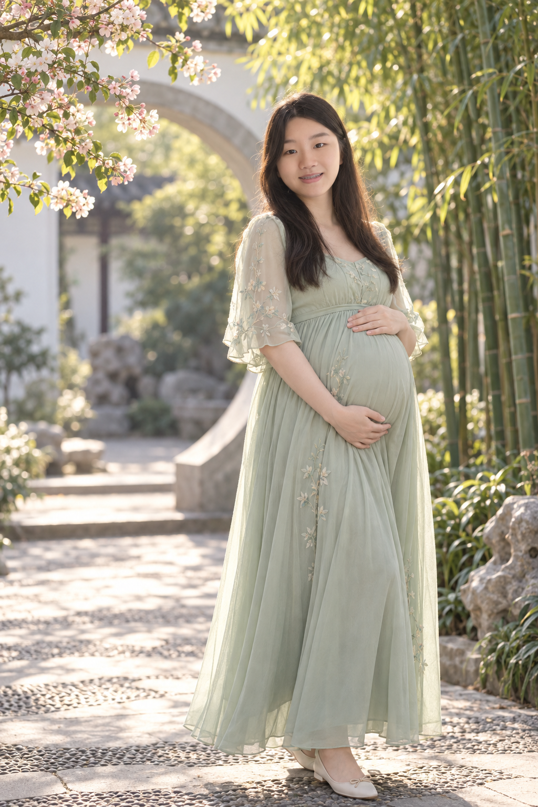

# 孕八个月写真相册

根据用户提供的夫妻合影，使用内置 image_gen 生成的 AI 创作照片。

共 5 张竖版 PNG：3 张夫妻合照、2 张孕妇单人照，分辨率均为 1024 × 1536。保留参考照片中的人物特征，搭配不同场景和自然笑容。

| 照片 | 场景与表情 | 查看原图 |
| --- | --- | --- |
| 01 夫妻合照 | 奶油色影棚，温柔闭口微笑 | [原图](01-ivory-studio.png) |
| 02 夫妻合照 | 玫瑰花园，粉色长裙，自然露齿微笑 | [原图](02-rose-garden.png) |
| 03 夫妻合照 | 日落海边，蓝色长裙，温馨依偎 | [原图](03-sunset-beach.png) |
| 04 孕妇单人 | 窗边暖光，香槟色长裙，温柔微笑 | [原图](04-window-solo.png) |
| 05 孕妇单人 | 中式庭院，浅绿色长裙，自然露齿微笑 | [原图](05-courtyard-solo.png) |

## 预览与手机保存

点击下方照片打开原图；在 GitHub 文件页点击 **Raw / Download raw file** 后，可以长按图片保存到手机相册。照片为 AI 创作写真。

生成方式：内置 `image_gen`。前 3 张的完整提示词如下，新增单人照的完整提示词见 [单人照提示词](SOLO_PROMPTS.md)。

## 完整生成提示词

### 1

Use case: identity-preserve. Create one beautiful photorealistic professional maternity couple portrait, vertical 2:3. Reference image is identity reference for the SAME adult wife (right) and husband (left). Preserve recognizable individual facial geometry, eyes, nose, lips, hairline, and natural East Asian appearance closely; husband keeps rectangular dark glasses, without blue reflections. Wife is eight months pregnant, naturally prominent round baby bump, anatomically plausible body. Scene: elegant warm ivory photography studio, soft linen curtains and subtle dried flowers, tasteful minimal decor. Wife in elegant opaque ivory off-shoulder maternity gown, husband in cream linen shirt and beige trousers, standing beside and slightly behind her, gentle embrace, her hands naturally cradling belly with clearly separate realistic fingers. Both faces turned toward camera, tender CLOSED-MOUTH smiles, no visible teeth. Three-quarter portrait from head to below knees showing full bump. Soft flattering window light, warm fine-art photographic finish, realistic skin texture, delicate makeup, high-end timeless family portrait. Only these two adults. No text, watermark, collage, black bars, deformed hands, exaggerated glamour retouching, or identity replacement.

### 2

Use case: identity-preserve. Generate a single beautiful photorealistic maternity couple portrait, vertical 2:3. Input image: identity reference for same adult wife on right and husband on left; preserve their distinctive recognizable facial shapes, eyes, noses, lips, natural age, hair and East Asian appearance. Husband retains rectangular dark glasses with clear lenses. Wife eight months pregnant with prominent anatomically natural rounded bump. Outdoor romantic garden with white and blush roses, soft green foliage and sunlit bokeh. Wife wears elegant pale blush opaque maternity dress, husband white open collar shirt and taupe trousers. Both standing close together, shoulders gently touching, looking toward camera with warm joyful natural TOOTH-SHOWING smiles (moderate, believable teeth, preserve their actual mouth shapes). Wife cradles her belly with one hand above and one below; husband places one arm gently around her upper back and other hand relaxed at side. Distinct natural hands. Frame head to below knees, clear full belly profile with body angled slightly toward camera. Golden late-afternoon natural light, sophisticated editorial family photography, realistic skin texture, airy romantic colors, flattering but faithful faces. Only two people, no text, watermarks, borders, collage, plastic skin or altered identities.

### 3

Use case: identity-preserve. Create one high-end photorealistic maternity couple photograph, vertical 2:3. Input photo is identity reference: preserve closely the SAME adult wife (reference right) and husband (reference left), their recognizable facial structure, eyes, noses, mouth shapes, hairline and East Asian appearance, husband wearing his dark rectangular glasses. Wife is eight months pregnant, clear naturally rounded prominent belly. Scene: peaceful beach at sunset with soft blue ocean, gentle waves and peach sky. Wife in elegant opaque dusty blue maternity maxi gown with softly flowing skirt, husband in ivory linen shirt sleeves casually rolled and sand-colored trousers. Pose: wife at slight three-quarter angle, husband standing close beside her with his arm gently around her shoulders; wife cradles baby bump with both hands, distinct anatomically correct fingers. Their temples gently lean toward each other, both faces visible toward camera, wife has serene closed-mouth smile, husband warm subtle tooth-showing smile. Compose from heads to ankles with sea and horizon visible, no cut-off heads, natural proportions. Warm sunset rim light plus soft face fill, sophisticated film-like tones, romantic cinematic editorial portrait, believable skin texture and faithful likeness, no excessive beauty retouch. Only two adults. No text, watermark, collage, border, extra limbs or distorted hands.
